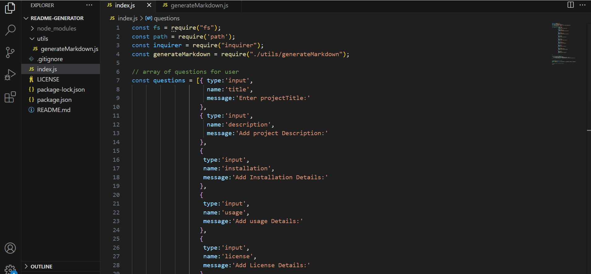

# Professional ReadMe Generator
   ## Description: 
      Professional ReadMe Generator , generates ReadMe file dynamically by getting user inputs from command line prompt.        

   ## Table of contents
   - [Description](#description)
   
   - [Demo](#demo)

   - [Installation](#installation)

   - [Usage](#usage)

   - [License](#license)

   - [Contributing](#contributing)

   - [Tests](#tests)

   - [Questions](#questions)

  ## Demo:

    
    
    The above demo describes When a user is prompted for information about the application repository then a high-quality, professional README.md is generated with:
   * The title of my project 
   * Sections entitled:
      * Description 
      * Table of Contents 
      * Installation 
      * Usage 
      * License 
      * Contributing 
      * Tests 
      * Questions
   * When a user enters the project title then it is displayed as the title of the README
   * When a user enters a description, installation instructions, usage information,License, contribution guidelines, and test instructions then this information is added to the sections of the README entitled Description, Installation, Usage,License, Contributing, and Tests
   * When a user enters their GitHub username then this is added to the section of the README entitled Questions, with a link to their GitHub profile
   * When a user enters their email address then this is added to the section of the README entitled Questions, with instructions on how to reach them with additional questions
   * When a user clicks on the links in the **Table of Contents** then they are taken to the corresponding section of the README
    

   ## Installation:
          Install inquirer package by running the command npm i.  
   ## Usage:
         To use the application, fork the repo , install all dependencies and run the index.js in integrated terminal.
   ## License:
         created using MIT license.
   ## Contributing:
          To contribute, clone the repo, create a feature branch , add your work and request a review.
          Branch will be merged to the main after the review.
   ## Tests:
               none
   ## Questions:
        Any Questions about this project contact me at
      Email: santhoshkumarvinothini@gmail.com.  
      [GitHub link](https://github.com/VinoSandy) 
              
  ## GitHub URL:
      https://github.com/VinoSandy/Readme-Generator.git

   
  